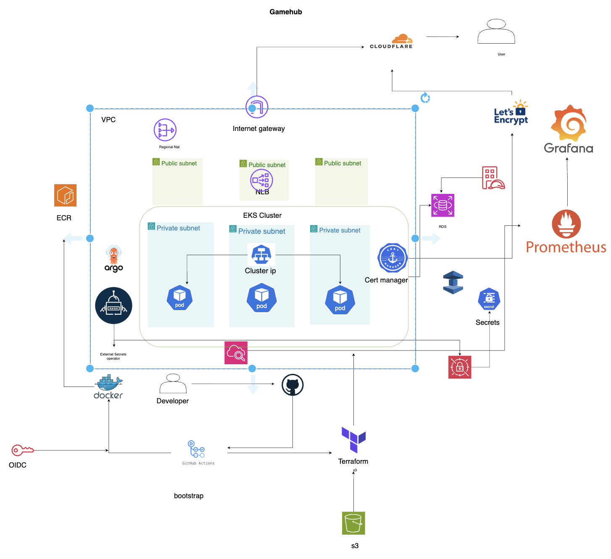

# The Game Hub
The game that came about due to high demand. I had many people asking for the game to be deployed. since its open source I wanted it to be cloud agnostic. so I decided to use kubernetes. I also see it as an oppurtunity to learn kubernetes and cloud native technologies. e will have a cicd pipeline to automate the deployment process. This includes building the docker image, pushing it to a registry, and deploying it to the kubernetes cluster. our preferred cloud  provider is AWS.

## System Design

The main components are:

- Terraform for infrastructure provisioning
- Argo CD for GitOps deployments
- Git for version control
- Pre-commit hooks to run linters and tests before commits
- TFLint to lint Terraform code
- CI/CD pipelines to build, publish, and deploy the application

